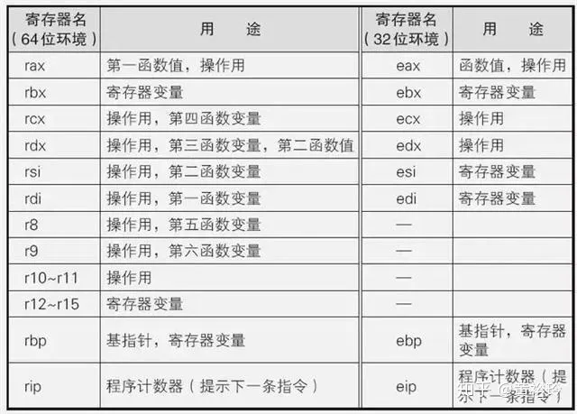
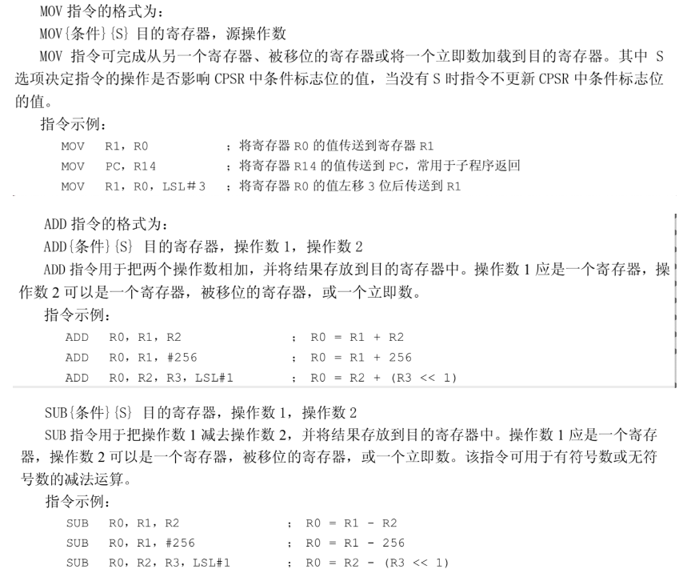
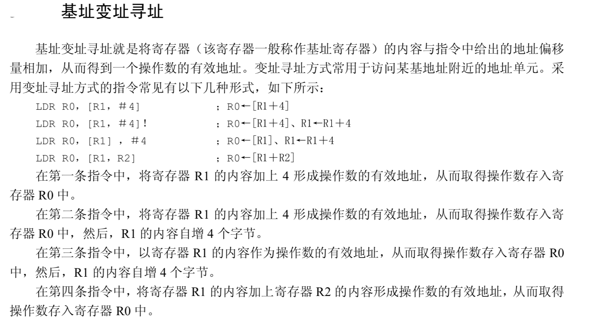

### X86寄存器



## ARM寄存器

### 通用寄存器

x0--x30都是64位的通用整形寄存器，w0--w30是它们的低32位寄存器。其中x0—x7常用来存放函数参数，更多的参数由堆栈传递，x0一般用做函数返回值，当返回值超过8个字节会保存在x0和x1中，浮点型的返回值会被保存在v0到v3这几个向量寄存器中。

### 向量（浮点型）寄存器

v0 ~ v31，一共有32个向量寄存器，每个寄存器大小是128位。分别可以用的方式来访问不同的位数。可以通过Bn、Hn、Sn、Dn、Qn来访问不同的位数。

Bn：8位，一个字节的数据
Hn：16位，两个字节的
Sn：32位
Dn：64位
Qn：128位

### 函数返回值的问题

整型返回值被保存在 x0 和 x1 中，而浮点值则保存在向量寄存器 v0 - v3 中。同时使用多个寄存器可以返回一个小型结构体类型返回值。

如果返回值为比较大的结构体，那么寄存器可能就变的不够用了。此时就需要调用者做出一些配合。调用者会在一开始为该结构体分配一块内存，然后将其地址提前写入到 x8 寄存器中。在设置返回值的时候，直接往该地址中写数据即可。

### 函数参数问题

一般来说，函数参数（整形参数、地址）不超过8个的话，会存放在x0--x7里面，如果是浮点型数据or超过八个，会在调用函数之前将这些参数入栈，函数调用完之后出栈。
如果是结构体，参数会放在r0--r7这个几个向量寄存器中，具体见代码：

```c
struct TestOne {
    double a;
    double b;
    double number;
    double type;
}TestOne;

void test(struct TestOne x) {
    x.a = 10;
    x.b = 20;
    x.number = 2;
    x.type = 11;
}


void call() {
    struct TestOne x = {0,0,0,0};
    test(x);
}
```

 转成的汇编代码：

```assembly
_test:                                  ; @test
	sub	sp,sp, #32             ; =32
	fmov	d4, #11.00000000
	fmov	d5, #2.00000000
	fmov	d6, #20.00000000
	fmov	d7, #10.00000000
	str	d0,[sp]
	str	d1,[sp, #8]
	str	d2,[sp, #16]
	str	d3,[sp, #24]			;存储d0--d3寄存器值(参数)
	str	d7,[sp]
	str	d6,[sp, #8]
	str	d5,[sp, #16]
	str	d4,[sp, #24]
	add	sp,sp, #32             ; =32
	ret


	.globl	_call                   ; -- Begin function call
_call:                                  ; @call
	sub	sp,sp, #48             ; =48
	stp	x29, x30,[sp, #32]     ; 8-byte Folded Spill
	add	x29,sp, #32            ; =32
	mov	x8, #0					;注意这，结构体地址先存放在x8中
	str	x8,[sp, #24]
	str	x8,[sp, #16]
	str	x8,[sp, #8]
	str	x8,[sp]				;在调用test函数之前，将结构体各成员变量都存进了栈空间
	ldr	d3,[sp, #24]
	ldr	d2,[sp, #16]
	ldr	d1,[sp, #8]
	ldr	d0,[sp]				;从栈空间中读取到d0--d3向量寄存器中，当做参数传递给test函数
	bl	_test
	ldp	x29, x30,[sp, #32]     ; 8-byte Folded Reload
	add	sp,sp, #48             ; =48
	ret
```

X8，间接寻址结果，当返回值（比如结构体size）大于16个字节的时候，该返回内容会被存到一个内存地址当中，然后这个内存地址的值会存入寄存器x8。后续Caller函数在使用该返回值的时候，会从X8寄存器中取出内存地址，并从内存地址取出内容的值。
D0--D31都是64位浮点寄存器，S0—S31是它们的低32位寄存器。

### 程序状态寄存器

cpsr寄存器（current program status register）,与cmp指令关系大
spsr寄存器（saved program ststus register，异常状态下使用）
lr(也就是x30)寄存器，链接寄存器
程序计数器pc(program counter) 存储着cpu当前执行的那一条指令地址，类似于8086汇编的cs:ip中的ip寄存器
位)

### 堆栈寄存器

sp(stack point)，指向函数分配栈空间的栈顶
fp(frame point)，也就是x29，指向函数分配栈空间的栈底

## ARM64常用汇编指令

```armasm

MOV    X1，X0         ;将寄存器X0的值传送到寄存器X1
ADD    X0，X1，X2     ;寄存器X1和X2的值相加后传送到X0
SUB    X0，X1，X2     ;寄存器X1和X2的值相减后传送到X0

AND    X0，X0，#0xF    ; X0的值与0xF相位与后的值传送到X0
ORR    X0，X0，#9      ; X0的值与9相位或后的值传送到X0
EOR    X0，X0，#0xF    ; X0的值与0xF相异或后的值传送到X0

LDR    X5，[X6，#0x08]        ；ld：load; X6寄存器加0x08的和的地址值内的数据传送到X5
LDP  x29, x30, [sp, #0x10]    ; ldp :load pair ; 一对寄存器, 从内存读取数据到寄存器

STR X0, [SP, #0x8]         ；st:store,str:往内存中写数据（偏移值为正）; X0寄存器的数据传送到SP+0x8地址值指向的存储空间
STUR   w0, [x29, #-0x8]   ;往内存中写数据（偏移值为负）
STP  x29, x30, [sp, #0x10]    ;store pair，存放一对数据, 入栈指令

CBZ  ;比较（Compare），如果结果为零（Zero）就转移（只能跳到后面的指令）
CBNZ ;比较，如果结果非零（Non Zero）就转移（只能跳到后面的指令）
CMP  ;比较指令，相当于SUBS，影响程序状态寄存器CPSR 

B   ;跳转指令，可带条件跳转与cmp配合使用
BL  ;带返回的跳转指令， 返回地址保存到LR（X30）
BLR  ; 带返回的跳转指令，跳转到指令后边跟随寄存器中保存的地址(例：blr    x8 ;跳转到x8保存的地址中去执行)
RET   ;子程序返回指令，返回地址默认保存在LR（X30）

```

## ARM64常见指令

### mov\add\sub\ret：

```armasm

_add:
add x0, x0, x1
ret

_sub:
sub x0, x0, x1
ret
```

对应的c语言就是int add(int a, int b) 与 int sub(int a, int b)
其中ret为函数返回，x0寄存器是用来做函数返回值



### cmp、条件域、cpsr寄存器

CBZ 比较（Compare），如果结果为零（Zero）就转移（只能跳到后面的指令）

CBNZ 比较，如果结果非零（Non Zero）就转移（只能跳到后面的指令）

```
_test:
mov x1, #0x9
mov x2, #0xA
cmp x2,x1
ret

;cmp指令是将两个寄存器的值相减,结果影响cpsr寄存器相关标志位的值
;这里比较x2与x1寄存器中的值，具体操作是x2 - x1
;如果结果是负数，那么cpsr寄存器第31位为1、第30位为0
;结果是0，cpsr寄存器的第31位为0、第30位为1
;结果是正数，cpsr寄存器的第31位为0、第30位为0

;具体描述是，cpsr状态寄存器的第31位为负数标记位、第30位为0标记位
;如果cmp的结果为负数，第31位为1，非负数为0
;cmp的结果为0，第30位为1，非0为1
```

### 寻址




## ARM汇编示例


函数的堆栈平衡分两种类型处理，一种是作用域内不再调用其他函数的函数，另一种是作用域内再调用了其他函数。

 作用域内不再调用其他函数的函数：

```c
void test(long a, long b) {
    long c = 10;
    if (a > b) {
        a = c;
    }
    else {
        a = b;
    }
}
```

 对应的汇编代码：(xcrun --sdk iphoneos clang -S -arch arm64 xxxx.c -o xxxx.s)

```assembly
	sub	sp,sp, #32             ; =32

	;----上面这一部门，是栈顶指针sp，相当于分配32个字节的栈空间给这个函数----
	mov	x8, #10
	str	x0,[sp, #24]		;x0参数a
	str	x1,[sp, #16]		;x1参数b
	str	x8,[sp, #8]
	ldr	x8,[sp, #24]
	ldr	x0,[sp, #16]
	cmp	x8, x0
	b.le	LBB0_2

	ldr	x8,[sp, #8]
	str	x8,[sp, #24]
	b	LBB0_3
LBB0_2:
	ldr	x8,[sp, #16]
	str	x8,[sp, #24]
	;----上面是函数的一些逻辑执行代码----

LBB0_3:
	add	sp,sp, #32             ; =32
	;----sp=sp + 32，这一步是回收函数一开始分配的32个字节的栈空间----
	ret

	;作用域内不再调用其他函数的函数，汇编代码相对简单，只需要将分配的栈空间回收即可
```

 作用域内再调用了其他函数:

```c
long test(long a, long b) {
    long c = 10;
    if (a > b) {
        a = c;
    }
    else {
        a = b;
    }
    return a;
}

void doSomething(long a, long b) {
    long c = a + b;
    long h = 40;
  
    if (c > h) {
        test(a, h);
    }
}
```

 doSomething的汇编代码：

```assembly
	sub	sp,sp, #64             ; =64
	stp	x29, x30,[sp, #48]     ; 8-byte Folded Spill
	add	x29,sp, #48            ; =48
	;----上面的代码，x29是fp寄存器、x30是lr寄存器，lr寄存器中存放着doSomething函数的返回地址
	;sp是doSomething函数分配栈空间栈顶地址，fp是指向doSomething函数的栈空间底部地址
	;实际而言给doSomething函数用的栈空间并没有占到64个字节，只是48个字节
	;剩下的16个字节，用来存放fp、lr了----

	mov	x8, #40
	stur	x0,[x29, #-8]
	stur	x1,[x29, #-16]
	ldur	x0,[x29, #-8]
	ldur	x1,[x29, #-16]
	add	x0, x0, x1
	str	x0,[sp, #24]
	str	x8,[sp, #16]
	ldr	x8,[sp, #24]
	ldr	x0,[sp, #16]
	cmp	x8, x0
	b.le	LBB1_2
	ldur	x0,[x29, #-8]
	ldr	x1,[sp, #16]
	bl	_test					;调用test函数
	str	x0,[sp, #8]            ; 8-byte Folded Spill
	;----上面的代码除了处理逻辑，还在调用test之前将x0、x1、x8的值存入内存
	;在调用完test之后，如果有用到对应参数，同样应该将x0、x1、x8的值恢复
	;保护函数调用前后的现场----

LBB1_2:
	ldp	x29, x30,[sp, #48]     ; 8-byte Folded Reload
	add	sp,sp, #64             ; =64
	;----这里恢复fp、lr的值、保持栈空间平衡、保护在调用该函数前的fp的值----
	ret
```

在汇编层面来说，对于函数的调用都是需要做现场保护操作的，具体来说就是利用sp分配的栈空间存储需要保护的数据，处理完主逻辑\调用完其他函数后，恢复各个寄存器初始的数据。
