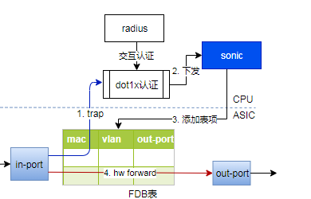
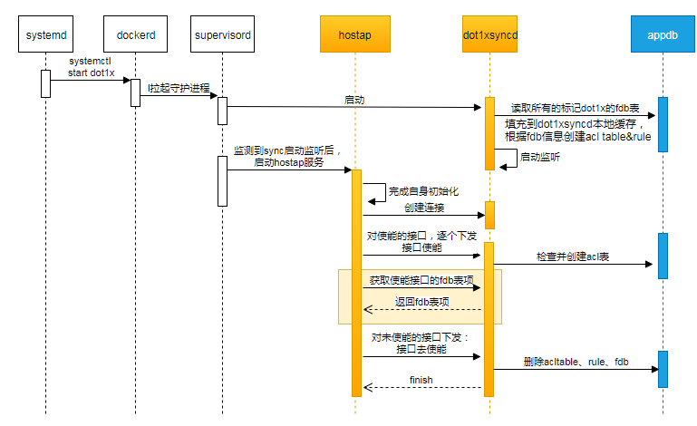
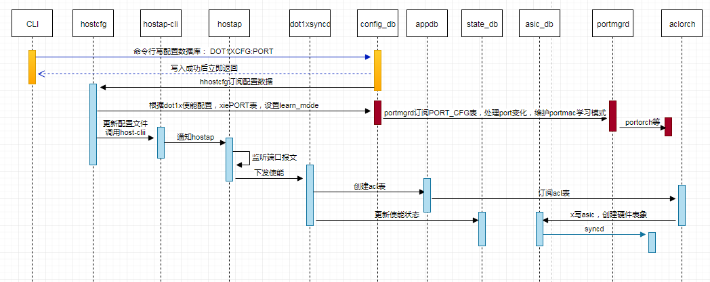
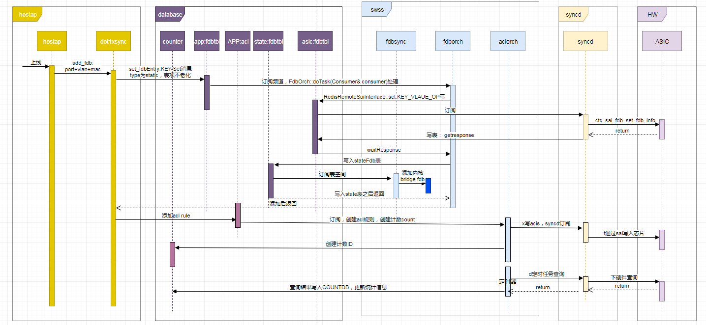

# Dot1x功能说明

## 1 概述

在支持dot1x的交换机上，报文处理流程简要如下图所示：



1. 交换机接收报文后，先查询入接口信息，mac_learing方式为未知源mac报文trap cpu（dot1x使能时设置），此时，查询FDB表，发现接收报文为未知源报文，将报文上送cpu处理
2. cpu监听使能dot1x功能接口上的所有报文，对非888e、dhcp、arp等报文，均丢弃处理。
   对888e等类型报文，发起和radius的认证，认证成功后通过sonic下发fdb表项给交换芯片fdb表
3. sonic通过sai下发fdb静态表项
4. 后续再收到报文，发现该报文为非未知源mac报文，走硬件转发

### 1.1 组件列表

在sonic中，支持dot1x功能，主要有如下几个组件：

* CLI：增加对radius模板配置、接口使能/去使能dot1x功能配置、全局使能去使能配置、在线用户信息查询、用户流量查询等交互功能
* host-servers：根据config数据库的变化，维护hostap的配置文件，更新服务等
* hostap：监听888e报文，通过和radis的交互，实现dot1x用户认证、计费等功能。主体由开源组件实现，补充不满足的功能。**特别是数据一致性，当hostap重启、接口状态发生变化导致hostap内部数据和app_db不一致时，应由hostap负责，从dot1xsyncd获取app_db数据，从radius获取在线用户数，然后做数据一致性对比工作。sonic只提供数据服务，不保证hostap的一致性性。**
* dot1xsyncd：提供和hostap通信接口，实现接口mac学习方式切换、fdb表项更新、用户流量信息查询等功能。
* fdbsync：订阅state_db，fdb表项下内核、订阅netlink事件等
* aclorch：提供acl服务，用于统计用户流量
* fdborch：处理appdb的fdb表，写asic数据库，维护硬件fdb表，写state_db，通知fdb变化
* syncd：fdb表项下asic等。

## 2 功能描述

### 2.1 Dot1x功能全局使能

拉起dot1x容器服务，启动hostap和dot1xsyncd进程。

dot1x全局使能功能不需要ewai的命令行，通过systemctl服务管理支持：

`systemctl start/stop/enable/disable dot1x #管理dot1x服务`

在dot1x全局使能之前， 可能已经配置了接口使能功能，因此，在hostap启动时需要根据接口使能信息监听对应的接口，并通知dot1xsyncd使能。dot1xsyncd在收到使能信息时，创建接口对应的acl表。初始化完成后，hostap从dot1xsyncd拉取所有在线用户信息。

在使能的过程中，保证hostap在dot1xsyncd启动之后，通过python:supervisord实现：

```shell
[program:hostap]
autorestart=true
command=/usr/sbin/hostap.sh
priority=10

[program:dot1xsyncd]
autorestart=true
command=/usr/sbin/dot1xsyncd 
priority=9 #更高优先级，保证dot1xsyncd先启动
```

在hostap.sh中检查dot1xsyncd监听的端口是否up，待up之后启动hostap：

```shell
#!/bin/bash

# Wait until dot1xsyncd started and listens on port 50001.
while [ -z "`netstat -tln | grep 50001`" ]; do
  echo 'Waiting for dot1xsyncd to start ...'
  sleep 1
done

# Start server.
echo 'Starting server...'
/usr/sbin/hostapd ...
```

全局使能流程图如下所示：



需要注意的是：

1. dot1xsyncd从app_db读取fdb信息时，只读取dot1x下发的fdb，因此，在appdb中的fdb type中增加一个值，表示fdb是有dot1x生成的静态表项。
2. dot1xsyncd读取恢复数据到本地缓存时，维护port、fdb间关系。
3. hostap在dot1xsyncd监听启动之后在运行
4. hostap起来之后需要重复下发接口使能，避免在服务运行前配置的接口使能不生效。
5. hostap起来后，获取所有使能接口的fdb表，维护本地数据。然后将没有使能的所有接口，下发去使能，dot1xsyncd接收该消息后，删除对应的数据

### 2.2 Dot1x功能全局去使能

在去使能的时候，不删除数据，待接口去使能dot1x功能时删除数据。

### 2.3 接口使能dot1x功能

命令行配置接口使能dot1x功能，hostcfg-server监听该配置，用于更新hostap的配置文件，同时设置配置PORT表的mac学习方式。hostap读取到使能后，监听对应的接口，并通知dot1xsyncd。

接口使能dot1x功能的流程如下图所示：



1. 首先，命令行配置dot1x功能使能，写入CFG_DB的新增表DOT1X:{port_name}中，增加属性用于表示使能/去使能，默认为未使能
2. hostcfg订阅配置数据，根据使能标记，更新PORT的mac学习方式，这个过程其他模块不参与，hostcfg写CFG_DB:PORT表，之后由portmgr处理后续流程写入硬件
3. hostcfg更新hostap的配置，并调用host-cli通知hostap
4. hostap通知dot1xsyncd。

后续，在用户上线之后需要统计流量，因此，dot1xsyncd需要创建acl统计流量。在接口使能时，创建两个acl表分别应用在接口入方向和出方向。

当用户上线后，分别创建acl rule用于统计入方向和出方向的流量，在dot1xsyncd中创建对应的acl rule， 统计信息由aclorch负责写入COUNTER_DB, acl规则描述如下：

```json
ACL_TABLE:dot1x_ingress_{port_name}： # 入方向acl表
    ACL_RULE:dot1x_ingress_{port_name}:{vlan}_{mac} #入方向acl规则
         根据源mac地址和vlan信息匹配报文

ACL_TABLE:dot1x_egress_{port_name}： # 出方向acl表
    ACL_RULE:dot1x_egress_{port_name}:{vlan}_{mac} #出方向acl规则
         根据目的mac地址和vlan信息匹配报文
```

### 接口去使能dot1x功能

命令行配置去使能功能，hostcfg监听，更新hostap配置文件，同时，修改PORT表mac学习方式为HW。hostap读取去使能信息后，下线所有用户，并通知dot1xsyncd。此处，如果在下线所有用户之前通知dot1x去使能，有dot1xsyncd负责删除所有fdb表。

### 用户上线

hostap上线用户后，将fdb信息推给dot1xsyncd，dot1xsyncd下发fdb，同时创建acl rule用于统计流量。



### 用户下线

hostap下线用户后，将fdb信息推给dot1xsyncd，dot1xsyncd删除fdb，同时删除acl rule。

### 统计信息获取

hostap通过dot1xsyncd获取统计信息，dot1x负责从COUNTDB读取统计数据返回给hostap

### 在线用户查询

CLI负责从hostap或者APPDB+CountDB读取数据。

## 3 ACL修改说明

dot1x用户在计费时，需要根据报文的mac地址和vlan信息做计费统计，当前acl配置不支持mac，因此需要做适配修改，对关键代码修改描述如下

### 3.1 增加acl表类型

当前acl表类型acl_table_type_t不支持对MAC的过滤，增加类型ACL_TABLE_DOT1X用于支持对mac地址过滤，创建类AclRuleDot1x，参考类AclRuleMclag，实现接口validateAddMatch， 支持mac配置。

在函数AclTable::create增加：

```c
    if (type == ACL_TABLE_DOT1X)
    {
        // 增加按mac地址过滤报文
        attr.id = SAI_ACL_ACTION_TYPE_SET_SRC_MAC;
        attr.value.booldata = true;
        table_attrs.push_back(attr);

        attr.id = SAI_ACL_ACTION_TYPE_SET_DST_MAC;
        attr.value.booldata = true;
        table_attrs.push_back(attr);
    }
```

在基类AclRule::validateAddMatch增加对machevlan的配置支持：

```c
        else if (attr_name == MATCH_SRC_MAC || attr_name == MATCH_DST_MAC) 
        {
            MacAddress(attr_value).getMac(value.aclfield.data.mac);
            memset(value.aclfield.mask.mac, 0xFF, ETHER_ADDR_LEN);
        }
```

### 3.2 acl配置

在接口使能dot1x时，创建acl表，并应用到接口上：

```c
        /*创建acl表， 计费统计按mac地址计费*/
        string acl_name = "dot1x_ingress_xxx";  // 按dot1x：+ 接口名方式命名
        FieldValueTuple desc_attr("policy_desc", "dot1x account ingress acl table for port xxx");
        acl_attrs.push_back(desc_attr);

        FieldValueTuple type_attr("type", "ACL_TABLE_DOT1X");
        acl_attrs.push_back(type_attr);

        FieldValueTuple port_attr("ports", xxx);
        acl_attrs.push_back(port_attr);

        FieldValueTuple port_attr("stage", "INGRESS");
        acl_attrs.push_back(port_attr);

        p_acl_table_tbl->set(acl_name, acl_attrs);

        // 创建出方向acl表，指定stage为EGRESS
```

用户上线时，创建acl rule：

```c
    string acl_rule_name = "dot1x_ingress_{port_name}:{mac}_{vlan}";

    /*Then create ACL rule table*/
    FieldValueTuple ip_type_attr("IP_TYPE", "ANY");
    acl_rule_attrs.push_back(ip_type_attr);

    FieldValueTuple mac_attr("SRC_MAC", mac);
    acl_rule_attrs.push_back(mac_attr);

    FieldValueTuple packet_attr("PACKET_ACTION", "FORWARD");
    acl_rule_attrs.push_back(packet_attr);

    p_acl_rule_tbl->set(acl_rule_name, acl_rule_attrs);
```

## dot1xsync

Dot1xSyncd提供和dot1x应用程序的通信接口，同时，连接redis数据库，将fdb表项写入app_db，并创建acl用于统计流量。其中，通信接口定义如下：

```c
typedef struct dot1x_msg_hdr_t_ {  // dot1x通信报文head定义
    uint8_t version;  
    uint8_t msg_type;
    uint16_t msg_len;
} dot1x_msg_hdr_t;

typedef enum dot1x_syncd_msg_type_e_ {    // dot1xsyncd发送给hostap的消息类型
    DOT1X_SYNCD_MSG_TYPE_NONE = 0,
    DOT1X_SYNCD_MSG_TYPE_FDB_ENTRY = 1,    // 返回fdb entry
} dot1x_syncd_msg_type_e;

typedef enum dot1x_msg_type_e_ {    // host发送给dot1xsyncd的消息类型
    DOT1X_MSG_TYPE_NONE = 0,
    DOT1X_MSG_TYPE_ACTIVE_PORT = 1,
    DOT1X_MSG_TYPE_DEACTIVE_PORT = 2,
    DOT1X_MSG_TYPE_SET_FDB_ENTRY = 3, // 设置fdb表项（静态，不老化，去激活时查询删除所有静态表项）
    DOT1X_MSG_TYPE_GET_STAT = 4,      // 获取统计数据
    DOT1X_MSG_TYPE_GET_FDB_ENTRY = 5 // 按port获取所有表项，用于恢复hostap数据
}dot1x_msg_type_e;
```
