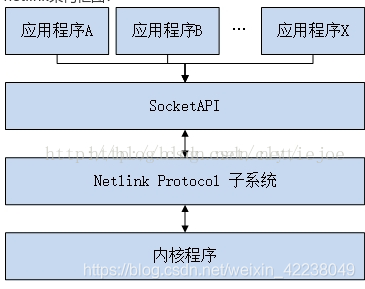

## NetLink介绍

Netlink是linux提供的用于内核和用户态进程之间的通信方式，具有如下优点：

* ① 支持全双工、异步通信(当然同步也支持)
* ② 用户空间可使用标准的BSD socket接口(但netlink并没有屏蔽掉协议包的构造与解析过程，推荐使用libnl等第三方库)
* ③ 在内核空间使用专用的内核API接口
* ④ 支持多播(因此支持“总线”式通信，可实现消息订阅)
* ⑤ 在内核端可用于进程上下文与中断上下文

Netlink协议基于BSD socket和AF_NETLINK地址簇，使用32位的端口号寻址，每个Netlink协议通常与一个或一组内核服务/组件相关联，如NETLINK_ROUTE用于获取和设置路由与链路信息、NETLINK_KOBJECT_UEVENT用于内核向用户空间的udev进程发送通知等。


## libnl介绍

libnl是为了方便应用程序使用netlink接口而开发的一个库。这个库为原始netlink消息传递以及不同的netlink family专用接口提供了一个统一的接口。

以下三个库都基于其核心库libnl：

* libnl-route：用于和Kernel中的Routing子系统交互。
* libnl-nf：用于和Kernel中的Netfilter子系统交互。
* libnl-genl：用于和Kernel中的Generic Netlink模块交互。

### 结构体

netlink message消息结构体

```
struct nl_msg{
        int                  nm_protocol;
        int                  nm_flags;
        struct sockaddr_nl   nm_src;
        struct sockaddr_nl   nm_dst;
        struct ucred         nm_creds;
        struct nlmsghdr *    nm_nlh;
        size_t               nm_size;
        int                  nm_refcnt;
};
```

netlink socket结构体

```
struct nl_sock{
   struct sockaddr_nl    s_local;
   struct sockaddr_nl    s_peer;
   int                   s_fd;
   int                   s_proto;
   unsigned int          s_seq_next;
   unsigned int          s_seq_expect;
   int                   s_flags;
   struct nl_cb *        s_cb;
};
```

### 回调函数

```
struct nl_cb{
   nl_recvmsg_msg_cb_t      cb_set[NL_CB_TYPE_MAX+1];
   void * cb_args[NL_CB_TYPE_MAX+1];
   nl_recvmsg_err_cb_t      cb_err;
   void *cb_err_arg;

   /** May be used to replace nl_recvmsgs with your own implementation in all internal calls to nl_recvmsgs. */
  int  (*cb_recvmsgs_ow)(struct nl_sock *,     struct nl_cb *);

   /** Overwrite internal calls to nl_recv, must return the number of octets read and allocate a buffer for the received data. */
  int   (*cb_recv_ow)(struct nl_sock *, struct sockaddr_nl *,   unsigned char **, struct ucred **);

   /** Overwrites internal calls to nl_send, must send the netlink message. */
  int    (*cb_send_ow)(struct nl_sock *,  struct nl_msg *);
  int   cb_refcnt;
};
```

```

 struct nl_sock *nl_socket_alloc(void);
 struct nl_sock *nl_socket_alloc_cb(struct nl_cb *cb);  
 int nl_connect(struct nl_sock *sk, int protocol); 
 void nl_close(struct nl_sock *sk);
 int nl_sendto(struct nl_sock *sk, void *buf, size_t size);  
 int nl_sendmsg(struct nl_sock *sk, struct nl_msg *msg, struct msghdr *hdr); 
 int nl_send(struct nl_sock *sk, struct nl_msg *msg);
 void nl_socket_set_cb(struct nl_sock *sk, struct nl_cb *cb);
 struct nl_cb *nl_socket_get_cb(const struct nl_sock *sk);
 int nl_socket_modify_cb(struct nl_sock *sk,   enum nl_cb_type type, enum nl_cb_kind kind,   nl_recvmsg_msg_cb_t func, void *arg);
```

## NetLink类介绍

基类，创建netlink连接

* NetLink::registerGroup 注册要监听的事件，加入组播组
* NetLink::dumpRequest 获取内核对应类型所有消息
