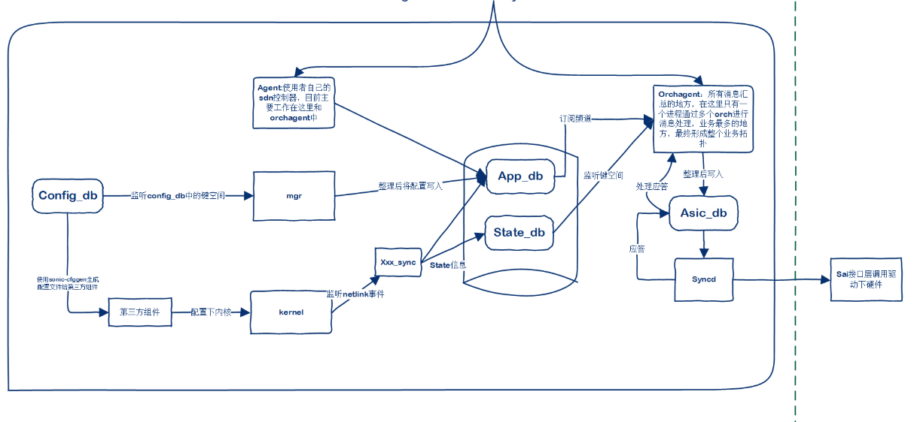

# sonic消息传递机制与架构

## sonic消息概述

sonic采用了大量的互相独立的第三方开源组件，这些组件在依赖、编译方式、配置方式上都存在很大的不同。为了让各种组件在sonic中互相协作，互不干扰，sonic采用容器技术为各个组件提供独立的运行环境，通过容器间共享命名空间通信。sonic中采用redis数据库作为消息传递平台，通过纯字符串消息方式屏蔽组件的插件，提供数据库表视图方式，不同组件互相独立工作，做到较高的内聚。

基于redis的发布订阅机制，sonic实现了两套消息系统，同时通过订阅键空间，在sonic中，数据库消息传递实际上有三种方式，在swss-common中通过lib方式对外提供。

- 键空间消息。通过订阅表键空间，获取到数据消息，由SubscriberStateTable类实现
- KEY_SET消息系统。通过set集合传递key，通过publish命令发布所有新产生的key。消费者通过key组合成一个hash表，获取真实消息，有类ProducerStateTable、ConsumerStateTable实现
- KEY_VALUE_OP消息系统。采用的是redis的list进行操作，严格保证操作顺序。一次操作在LIST中压入三个值，分别为key，value，operate。value把hash表进行json编码后形成字符串，订阅者得到消息后解码还原。由类ConsumerTable、ProducerTable实现
  
key_set消息举例：
```
"EVALSHA" "6875900592cdd1621c6191fe038ec3b29775aa13" "6" "VLAN_TABLE_CHANNEL" "VLAN_TABLE_KEY_SET" "_VLAN_TABLE:Vlan2222" "_VLAN_TABLE:Vlan2222" "_VLAN_TABLE:Vlan2222" "_VLAN_TABLE:Vlan2222" "G" "Vlan2222" "admin_status" "up" "mtu" "9100" "mac" "52:54:33:12:34:56" "host_ifname" ""

ProducerStateTable::set执行如上lua脚本，发布消息，以上脚本具体会执行：
    "SADD" "VLAN_TABLE_KEY_SET" "Vlan2222"     # 新产生的key写入VLAN_TABLE_KEY_SET       
	"HSET" "_VLAN_TABLE:Vlan2222" "admin_status" "up"   # 临时hash表写入value
	"HSET" "_VLAN_TABLE:Vlan2222" "mtu" "9100"
	"HSET" "_VLAN_TABLE:Vlan2222" "mac" "52:54:33:12:34:56"
	"HSET" "_VLAN_TABLE:Vlan2222" "host_ifname" ""
    "PUBLISH" "VLAN_TABLE_CHANNEL" "G"  #发布频道消息

ConsumerStateTable订阅消息并处理，然后交给对应的Orch处理，具体参见vlan分析描述
```

KEY_VALUE_OP消息举例：
```
"EVALSHA" "d171e04fd79e95ca2287f3b067c46ae76a82208b" "2" "ASIC_STATE_KEY_VALUE_OP_QUEUE" "ASIC_STATE_CHANNEL" "SAI_OBJECT_TYPE_VLAN:oid:0x260000000b50a1" "[\"SAI_VLAN_ATTR_VLAN_ID\",\"2222\"]" "Screate" "G"

ProducerTable执行上述脚本，实际执行如下命令
   "LPUSH" "ASIC_STATE_KEY_VALUE_OP_QUEUE" "SAI_OBJECT_TYPE_VLAN:oid:0x260000000b50a1" "[\"SAI_VLAN_ATTR_VLAN_ID\",\"2222\"]" "Screate"  # list中依次压入三个key
   "PUBLISH" "ASIC_STATE_CHANNEL" "G" #发布消息

ConsumerTable订阅消息并处理，然后交给对应的Orch处理，具体参见vlan分析描述
```

## sonic消息架构



1. 在上图所示中，mgr等服务订阅config_db的键空间，获取配置表变化，然后作为发布者，以KEY_SET方式发布到app_db
2. 第三方组件，比如bgp、hostap、lldp、lacp等等，监听etlink、以太、tcp等，生成处理各种运行数据（路由、mac表、聚合状态等等），通过xxx_sync，发布到运行数据和state_db，发布方式有KEY_SEt和KEY_VALUE_OP
3. swss服务orchagent订阅以上频道，汇聚各种消息，然后通过Orch调度消息处理，整理后通过KEY_VALUE_OP发布到ASic_db。同时orchagent和syncd间通过同步或者异步方式获取表项下发处理结果。
4. syncd订阅swss的频道，调用sai接口下硬件，并将结果反馈给swss 


## 代码解析

数据类型：
```
typedef std::pair<std::string, std::string> FieldValueTuple;
#define fvField std::get<0>
#define fvValue std::get<1>
typedef std::tuple<std::string, std::string, std::vector<FieldValueTuple> > KeyOpFieldsValuesTuple;
#define kfvKey    std::get<0>
#define kfvOp     std::get<1>
#define kfvFieldsValues std::get<2>

```

发布者：
```
class ProducerTable : public TableBase, public TableName_KeyValueOpQueues
class ProducerStateTable : public TableBase, public TableName_KeySet
   聚合对象RedisPipeline *m_pipe  // 批量处理redis请求
```

订阅者：
```
class ConsumerStateTable : public ConsumerTableBase, public TableName_KeySet
class ConsumerTable : public ConsumerTableBase, public TableName_KeyValueOpQueues
   ConsumerTableBase: public TableConsumable, public RedisTransactioner
     class TableConsumable : public TableBase, public TableEntryPoppable, public RedisSelect
       class RedisSelect : public Selectable
```

数据库类：
```
wss common封装了对redis数据库各种数据类型读写、订阅/发布等的封装，简要关系如下所示：
	RedisContext，数据库连接基类，维护并管理和redis的连接结构redisContext *m_conn
	RedisCommand：提供对数据库命令的格式化封装.
	RedisReply：封装对redis命令的执行
	RedisPipeline：封装对redis命令的批量执行
	DBConnector：继承RedisContext，封转hiredis，提供各种数据类型的操作封装。
	RedisTransactioner：内部持有一个DBConnector，提供对数据库事务操作的封装。
	DBInterface：数据库操作接口，以数据库名为key存储DBConnector对应map信息，封装以数据库名称+操作的接口，集合了多个数据库操作封装到一起。
	SonicV2Connector_Native：继承DBInterface，封装数据库操作
	ConfigDBConnector_Native，ConfigDBPipeConnector_Native：封装对config数据库操作。
```
