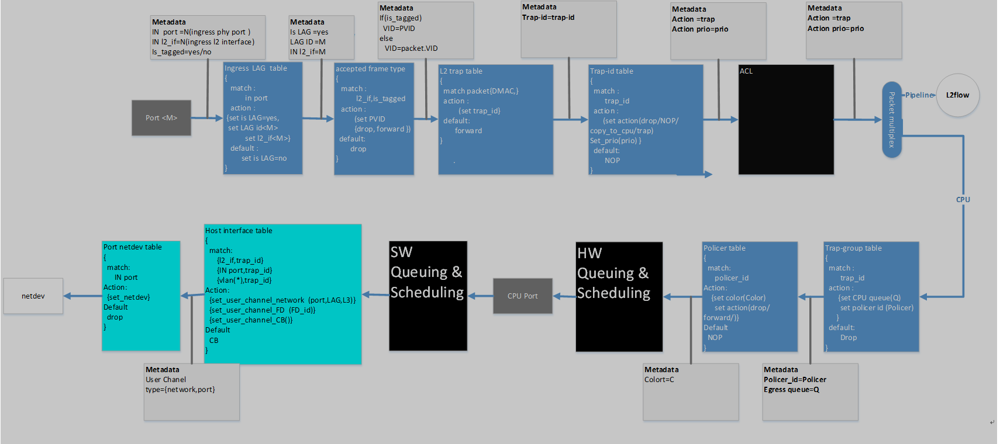
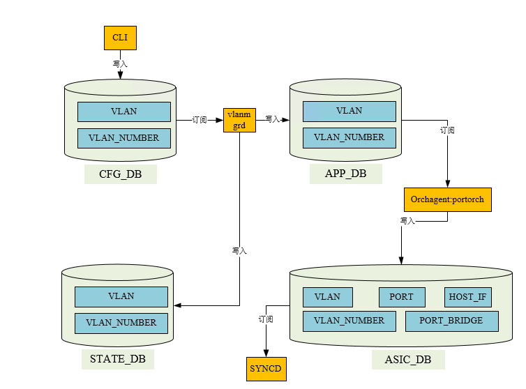
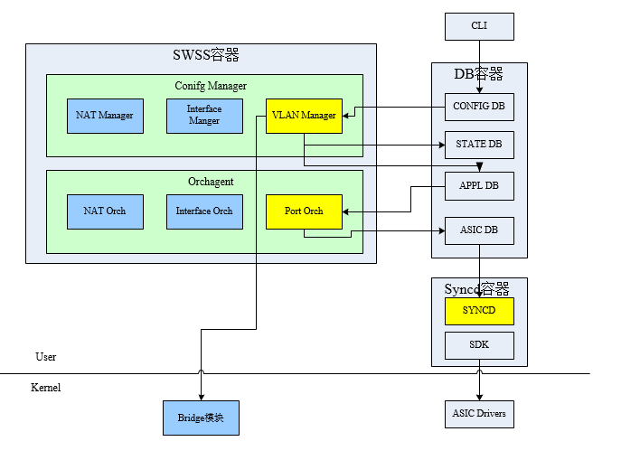
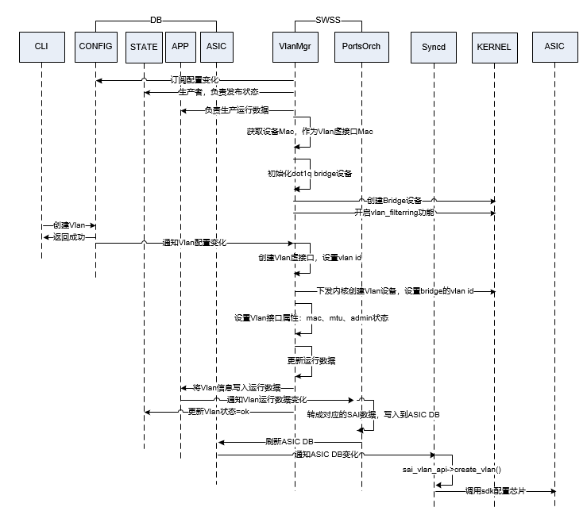
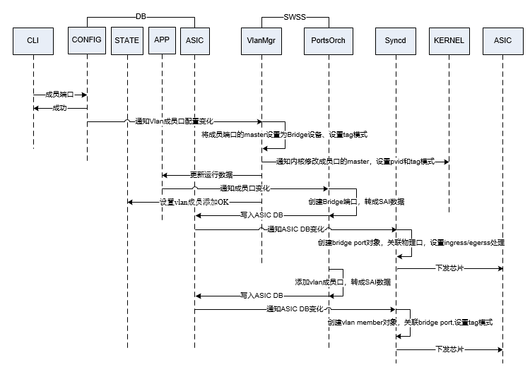

# SONiC系统vlan功能剖析

## 1 vlan功能需求

满足用户按网络需求自定义VLAN，配置命令如下

- config vlan { add | del } <vid> # 完成vlan创建/删除
- config vlan member { add | del }  [ --untagged ] <vid> port # 完成vlan成员加入/离开，tag模式设置
- show vlan { config | brief } # 显示vlan配置和概要信息

通过用户配置完成对硬件芯片的设置，支持VLAN三层虚拟接口，提供L3能力。

## 2. 转发面模型分析
### 2.1 linux kernel
sonic在linux上创建Bridge设备，并使能vlan_filtering功能，实现内核层面虚拟交换机功能。
```
+----------------------------------------------------------------+
|                                                                |
|       +------------------------------------------------+       |
|       |             Newwork Protocol Stack             |       |
|       +------------------------------------------------+       |
|           ↑                ↑                                   |
|...........|................|...................................|
|           ↓                ↓                         ↑         |
|       +------+    +-----------------+                |         |
|       | eth0 |    |      Bridge     |                |         |
|       +------+    +-----------------+                |         |
|                       ↑            ↑                 |         |
|                       ↓            ↓                 ↓         |
|                +-----------+    +-----------+   +-----------+  |
|                | Eth-trunk |    | Eth-trunk |   | Eth-Route |  |
|                +-----------+    +-----------+   +-----------+  |
|                                                                |
+----------------------------------------------------------------+
```
如上图所示，在系统测试花时，创建Bridge设备，并使能vlan filter，删除缺省vid。 

添加vlan时在会执行如下命令：

bridge vlan add vid {{vlan_id}} dev Bridge self # Bridge设备允许vlan通过

ip link add link Bridge up name Vlan{{vlan_id}} address {{gMacAddress}} type vlan id {{vlan_id}} # 创建vlan device

添加vlan成员时执行命令：
ip link set {{port_alias}} master Bridge #接口加入Bridge，后续接口收到的报文会送到Bridge设备

bridge vlan del vid 1 dev port_alias  #删除缺省vid

bridge vlan add vid {{vlan_id}} dev {{port_alias}} {{tagging_mode}} #配置vlan过滤功能

bridge功能介绍：
```
bridge vlan { add | del } dev DEV vid VID [ tunnel_info TUNNEL_ID
               ] [ pvid ] [ untagged ] [ self ] [ master ]


bridge vlan add - add a new vlan filter entry
       This command creates a new vlan filter entry.

       dev NAME
              the interface with which this vlan is associated.

       vid VID
              the VLAN ID that identifies the vlan.

       tunnel_info TUNNEL_ID
              the TUNNEL ID that maps to this vlan. The tunnel id is set
              in dst_metadata for every packet that belongs to this vlan
              (applicable to bridge ports with vlan_tunnel flag set).

       pvid   the vlan specified is to be considered a PVID at ingress.
              Any untagged frames will be assigned to this VLAN.
              指定该参数，接口收到不带vlan id的报文时，会给报文添加pvid

       untagged
              the vlan specified is to be treated as untagged on egress.
              指定该参数，报文从端口出去时，会剥离vlan

       self   the vlan is configured on the specified physical device.
              Required if the device is the bridge device.

       master the vlan is configured on the software bridge (default).
```

### 2.2 SAI & ASIC
硬件转发层面资料较少，目前没有完整的资料。在[SAI说明文档](https://github.com/opencomputeproject/SAI/tree/master/doc)中有部分介绍，其中，hostif定义在saihostif.h中，转发模型如下：



## 3 数据库设计

SONiC通过DB表进行组件间解耦，围绕数据进行功能设计。
按照当前VLAN功能需求，需要完成如下数据库设计：
- CONFIG_DB 配置数据库：保存用户的配置数据，主要涉及VLAN创建/删除、成员口加入/离开和模式信息
- APPL_DB 运行数据库：保存后台进程的运行数据
- ASIC_DB 芯片数据库：记录下发到硬件的VLAN配置、成员口配置
- STATE_DB 状态数据库：对外提供的配置状态，满足其他扩展功能检查VLAN的有效性



### 3.1 CONFIG DB

#### 3.1.1 VLAN表
VLAN表存储VLAN用户创建的vlan信息，类型为hash，key为VLAN|Vlan{vlanid}

|  key    | value    |
|  ----   | ----     |
| vlanid  | 1*4digit |

#### 3.1.2 VLAN NUMBER表
存储用户配置的vlanvlan 成员信息，类型hash，key为VLAN_MEMBER|Vlan{vlanid}|{port}
|  key          | value    |
|  ----         | ----     |
| tagging_mode  | tagged/untagged |

tagging_mode表示在Egress方向，是否剥离vlanid，如果为untagged，则剥离

### 3.2 APP DB
#### 3.2.1 VLAN表
存储运行vlan信息，类型hash，key为"VLAN_TABLE:Vlan{vlanid}"
|  key          | value          |
|  ----         | ----           |
| admin_status  | 状态（up/down） |
| mtu           | mtu值           |
| mac           | mac地址         |
| host_ifname   | host_ifname名   |

#### 3.2.2 VLAN NUMBER表
运行vlan number信息，类型hash，key为VLAN_MEMBER|Vlan{vlanid}|{port}
|  key          | value    |
|  ----         | ----     |
| tagging_mode  | tagged/untagged |

### 3.3 STATE DB
存储vlan下发状态、vlan_number下发状态，提供给其他模块查询。

### 3.4 ASIC DB

#### 3.4.1 BRIDGE_PORT  

端口网桥，存储mac学习方式属性，类型hash，key为ASIC_STATE:SAI_OBJECT_TYPE_BRIDGE_PORT:oid:{bridge_port_oid}

|  key                                     | value|
|  ----                                    | ----------|
| SAI_BRIDGE_PORT_ATTR_TYPE                | 取值由sai描述  |
| SAI_BRIDGE_PORT_ATTR_PORT_ID             | {port_id} 外键，根据ID查询PORT表|
| SAI_BRIDGE_PORT_ATTR_ADMIN_STATE         | 状态        |
| SAI_BRIDGE_PORT_ATTR_FDB_LEARNING_MODE   | MAC学习方式   |

#### 3.4.2 PORT信息表
类型hash，key为ASIC_STATE:SAI_OBJECT_TYPE_PORT:oid:{port_id_oid}
|  key          | value          |
|  ----         | ----           |
| SAI_PORT_ATTR_ADMIN_STATE    | 状态（up/down） |
| SAI_PORT_ATTR_SPEED          | speed           |
| SAI_PORT_ATTR_MTU            | mtu         |
| SAI_PORT_ATTR_PORT_VLAN_ID   | PVID   |

#### 3.4.3 VLAN信息表
类型hash， key为ASIC_STATE:SAI_OBJECT_TYPE_VLAN:oid:{vlan_id_oid}
|  key                   | value    |
|  ----                  | ----     |
| SAI_VLAN_ATTR_VLAN_ID  | 1*4digit |

#### 3.4.4 VLAN NUMBER表
类型hash，key为ASIC_STATE:SAI_OBJECT_TYPE_VLAN_MEMBER:oid:{vlan number oid}
|  key          | value          |
|  ----         | ----           |
| SAI_VLAN_MEMBER_ATTR_VLAN_ID                 | vlan id,  {vlan_id_oid}|
| SAI_VLAN_MEMBER_ATTR_BRIDGE_PORT_ID          | {bridge_port_oid}           |
| SAI_VLAN_MEMBER_ATTR_VLAN_TAGGING_MODE       | tagged/untagged         |

#### 3.4.5 HOSTIF
类型为hash，keyASIC_STATE:SAI_OBJECT_TYPE_HOSTIF:oid:{hostif_oid}
|  key          | value          |
|  ----         | ----           |
| SAI_HOSTIF_ATTR_TYPE           | SAI定义 |
| SAI_HOSTIF_ATTR_OBJ_ID         | {port_id_oid}           |
| SAI_HOSTIF_ATTR_NAME           | 名称         |
| SAI_HOSTIF_ATTR_OPER_STATUS    | true/false   |
| SAI_HOSTIF_ATTR_VLAN_TAG       | SAI_HOSTIF_VLAN_TAG_KEEP |

## 4 流程分析

### 4.1 vlan在系统中的位置



### 4.2 vlan创建


### 4.2 vlan number添加




## 5 代码剖析
- sonic-utilties：命令行配置界面，显示和配置vlan信息
- vlanmgrd进程：vlan配置管理进程，运行在swss容器，由python supervisord模块管理，swss容器启动后，由init进程 supervisord拉起并管理。订阅vlan配置数据库表(VLAN,VLAN_MEMBER), 处理配置创建linux网桥等，并写APP_DB。
- PortOrch模块：运行在swss容器的orchagent进程中，orchagent进程管理方式和vlanmgrd相同。订阅APP_DB,处理数据写入ASIC_DB
- syncd进程：调用SAI接口下发端口属性、PVID等信息置芯片

### 5.1 sonic-utilties

- show vlan: 代码位于src/sonic-utilities/show/vlan.py, 读配置数据库并显示
- config vlan: 代码位于sonic-tilities/config/vlan.py, 检查并写配置数据库。

其中，读写数据库配置操作封装在swss-py-swsssdk项目中，可自行查阅。此处以添加vlan举例说明

```
#
# 'vlan' group ('config vlan ...')
#
@click.group(cls=clicommon.AbbreviationGroup, name='vlan')
def vlan():
    """VLAN-related configuration tasks"""
    pass

@vlan.command('add')
@click.argument('vid', metavar='<vid>', required=True, type=int)
@clicommon.pass_db
def add_vlan(db, vid):
    """Add VLAN"""

    ctx = click.get_current_context()

    if not clicommon.is_vlanid_in_range(vid):
        ctx.fail("Invalid VLAN ID {} (1-4094)".format(vid))

    vlan = 'Vlan{}'.format(vid)
    if clicommon.check_if_vlanid_exist(db.cfgdb, vlan):
        ctx.fail("{} already exists".format(vlan))

    db.cfgdb.set_entry('VLAN', vlan, {'vlanid': vid})

```

### 5.2 vlanmgrd

vlan配置管理进程，守护进程代码在sonic-swss/cfgmgr/vlanmgrd.cpp, 核心代码在sonic-swss/cfgmgr/vlanmgr.cpp，由类VlanMgr实现。

#### 5.2.1 vlanmgrd守护进程框架
在vlanmgrd守护进程中，订阅CFG_DB的VLAN,VLAN_MEMBER键空间，当通过命令配置vlan信息时，redis唤醒vlanmgrd进程处理消息。框架核心代码简化如下，swss代码c++实现，因c++继承、多态较为复杂，代码梳理需要更多耐心：
```
# vlanmgrd.cpp main()
int main(int argc, char **argv)
{
    
        // 订阅的vlan 配置表
        vector<string> cfg_vlan_tables = {
            CFG_VLAN_TABLE_NAME,
            CFG_VLAN_MEMBER_TABLE_NAME,
        };

        // 创建VlanMgr，调用Orch::addConsumer订阅键空间
        VlanMgr vlanmgr(&cfgDb, &appDb, &stateDb, cfg_vlan_tables);

        // 加入多路复用fd 
        s.addSelectables(o->getSelectables());
        
        while (true)
        {
            Selectable *sel;
            int ret;

            ret = s.select(&sel, SELECT_TIMEOUT);
            if (ret == Select::ERROR)
            {
                SWSS_LOG_NOTICE("Error: %s!", strerror(errno));
                continue;
            }
            if (ret == Select::TIMEOUT)
            {
                // 超时，调用Orch::doTask()父类成员处理缓存的订阅消息
                vlanmgr.doTask();
                continue;
            }

            // 订阅数据到达，执行Consumer::execute(), 数据写入m_toSync，然后优先处理当前消息
            auto *c = (Executor *)sel;

            // 处理消息实际调用的子类成员m_orch->doTask(*this) VlanMgr::doTask
            // VlanMgr::doTask处理消息，然后将消息从m_toSync移除
            c->execute();
        }
    }
}

```

#### 5.2.2 class VlanMgr

VlanMgr处理订阅的CFG_DB vlan表键空间消息并处理消息，核心成员
- VlanMgr::doVlanTask(Consumer &consumer)            处理vlan消息
- VlanMgr::doVlanMemberTask(Consumer &consumer)     处理vlan member消息

两个成员调用入口参数及调用关系记录如下，方便理解学习,其中m_toSync为multimap，成员为std::tuple，在阅读代码时刻参考以下信息方便理解。
```
(gdb) p consumer  #具体的consumer对象信息
$2 = (Consumer &) @0x55818eb15dc0: {
  <Executor> = {
    <swss::Selectable> = {
      _vptr.Selectable = 0x55818e9bcb48 <vtable for Consumer+16>,
      m_priority = 0,
      m_last_used_time = {
        __d = {
          __r = 41882490385765
        }
      }
    },
    members of Executor:
    m_selectable = 0x55818eb18528,
    m_orch = 0x7ffcf6a6b160,
    m_name = "VLAN"
  },
  members of Consumer:
  m_toSync = std::multimap with 1 element = {
    ["Vlan2991"] = std::tuple containing = {
      [1] = "Vlan2991",
      [2] = "SET",
      [3] = std::vector of length 1, capacity 1 = {{
          first = "vlanid",
          second = "2991"
        }}
    }
  }
}
(gdb) bt
#0  swss::VlanMgr::doVlanTask (this=0x7ffcf6a6b160, consumer=...) at vlanmgr.cpp:268
#1  0x000055818e985a9b in swss::VlanMgr::doTask (this=0x7ffcf6a6b160, consumer=...) at vlanmgr.cpp:672
#2  0x000055818e99e2e6 in Consumer::execute (this=0x55818eb15dc0) at ../orchagent/orch.cpp:223
#3  0x000055818e97e2a4 in main (argc=<optimized out>, argv=<optimized out>) at vlanmgrd.cpp:106

(gdb) p consumer  #VlanMgr::doVlanMemberTask调用
$7 = (Consumer &) @0x55818eb1ae00: {
  <Executor> = {
    <swss::Selectable> = {
      _vptr.Selectable = 0x55818e9bcb48 <vtable for Consumer+16>,
      m_priority = 0,
      m_last_used_time = {
        __d = {
          __r = 42269163525353
        }
      }
    },
    members of Executor:
    m_selectable = 0x55818eb19238,
    m_orch = 0x7ffcf6a6b160,
    m_name = "VLAN_MEMBER"
  },
  members of Consumer:
  m_toSync = std::multimap with 1 element = {
    ["Vlan2990|Ethernet32"] = std::tuple containing = {
      [1] = "Vlan2990|Ethernet32",
      [2] = "SET",
      [3] = std::vector of length 1, capacity 1 = {{
          first = "tagging_mode",
          second = "tagged"
        }}
    }
  }
}
```

### 5.3 orchagent：portorch

#### 5.3.1 初始化

在orchagent初始化时(swss/orchagent/main.cpp)，创建：

` auto orchDaemon = make_shared<OrchDaemon>(&appl_db, &config_db, &state_db); 

然后调用init实例化PortOrch(swss/orchagent/Orchdeamon.cpp)：

` gPortsOrch = new PortsOrch(m_applDb, ports_tables);

订阅APP_VLAN_TABLE_NAME和APP_VLAN_MEMBER_TABLE_NAME，然后在主循环(swss\orchagent\portsorch.cpp处理vlan事件：

- void PortsOrch::doVlanTask(Consumer &consumer)
- void PortsOrch::doVlanMemberTask(Consumer &consumer)

#### 5.3.2 Sai初始化
orchagent线程启动时，调用initSaiApi初始化Sai，然后调用sai_api_query(sai_redis_interfacequery.cpp)初始化Sai适配器。

初始化流程：
```
    initSaiApi();   
     -- sai_api_initialize() : sai_redis_interfacequery.cpp
      -- Sai::initialize()
       -- m_recorder = std::make_shared<Recorder>(); 序列化
       -- auto context = std::make_shared<Context>(cc, m_recorder, std::bind(&Sai::handle_notification, this, _1, _2));
         -- Meta::initialize
           -- RedisRemoteSaiInterface::initialize
     -- sai_api_query(): 对sai_switch_api、sai_vlan_api等赋值       
```

#### 5.3.3 vlan添加
和vlanmgr类似，portorch订阅了APPDB的VLAN表，当有vlan添加时，vlanmgr会写APPDB表VLAN(KEY-SET)，唤醒orchagent进程处理消息，具体的处理函数PortsOrch::doVlanTask(Consumer &consumer)

函数参数：
```
 (gdb) p consumer
$2 = (Consumer &) @0x55febb6cfd10: {
  <Executor> = {
    <swss::Selectable> = {
      _vptr.Selectable = 0x55feba8cfc40 <vtable for Consumer+16>,
      m_priority = 0,
      m_last_used_time = {
        __d = {
          __r = 65628776654764
        }
      }
    },
    members of Executor:
    m_selectable = 0x55febb6cee28,
    m_orch = 0x55febb6cc620,
    m_name = "VLAN_TABLE"
  },
  members of Consumer:
  m_toSync = std::multimap with 1 element = {
    ["Vlan267"] = std::tuple containing = {
      [1] = "Vlan267",
      [2] = "SET",
      [3] = std::vector of length 4, capacity 4 = {{
          first = "admin_status",
          second = "up"
        }, {
          first = "mtu",
          second = "9100"
        }, {
          first = "mac",
          second = "52:54:33:12:34:56"
        }, {
          first = "host_ifname",
          second = ""
        }}
    }
  }
}
```

核心函数调用流程：
```
 -- PortsOrch::doVlanTask(Consumer &consumer)
  -- addVlan
     -- sai_vlan_api->create_vlan  // sai_vlan_api在sai_api_query(sai_redis_interfacequery.cpp)中赋值为redis_vlan_api
      -- redis_vlan_api
        -- （redis_create_vlan）REDIS_CREATE(vlan)  // 通用宏定义函数封装
         -- redis_sai->create  // redis_sai为全局变量，类型为Sai
           -- Sai::create
            -- context->m_meta->create // context等在initialize()时初始化
             -- saimeta::Meta::create
               -- m_implementation->create （m_implementation = RedisRemoteSaiInterface）
                -- RedisRemoteSaiInterface::create
                 -- m_communicationChannel->set （RedisChannel， ASIC_STATE_TABLE ）
                  -- m_asicState->set
                   -- ProducerTable::set （写入ASIC_DB表ASIC_STATE_TABLE）
```

#### 5.3.4 vlan member添加
类似的， vlan member添加的核心函数为：PortsOrch::doVlanMemberTask(Consumer &consumer)，函数参数：
```
(gdb) p
$6 = (Consumer &) @0x55febb6d0bd0: {
  <Executor> = {
    <swss::Selectable> = {
      _vptr.Selectable = 0x55feba8cfc40 <vtable for Consumer+16>,
      m_priority = 0,
      m_last_used_time = {
        __d = {
          __r = 65918768511339
        }
      }
    },
    members of Executor:
    m_selectable = 0x55febb6cfdd8,
    m_orch = 0x55febb6cc620,
    m_name = "VLAN_MEMBER_TABLE"
  },
  members of Consumer:
  m_toSync = std::multimap with 1 elements = {
    ["Vlan267:Ethernet100"] = std::tuple containing = {
      [1] = "Vlan267:Ethernet100",
      [2] = "SET",
      [3] = std::vector of length 1, capacity 1 = {{
          first = "tagging_mode",
          second = "tagged"
        }}
    }
  }
}
```

核心函数调用流程：
```
 -- PortsOrch::doVlanMemberTask(Consumer &consumer)
   --addBridgePort(port) && addVlanMember(vlan, port, tagging_mode)
    
  -- addBridgePort(port):
    -- sai_bridge_api->create_bridge_port
     -- redis_bridge_api->redis_bridge_api
      -- redis_sai->create 
       -- ... 

     -- sai_vlan_api->create_vlan_member(类似vlan add)
  

```

### 5.4 syncd

syncd进程代码在src/sonic-sairedis/syncd中，初始化入口syncd_main。

sai初始化调用关系为：
```
 // step1: 创建vendorSai，实现SaiInterface，读取ASIC并下芯片
 auto vendorSai = std::make_shared<VendorSai>();
 // 构建Syncd对象时调用vendorSai初始化sai
 auto syncd = std::make_shared<Syncd>(vendorSai, commandLineOptions, isWarmStart);

// step2 初始化vendorSai，在initialize初始化sai接口
sai_status_t status = vendorSai->initialize(0, &m_test_services);

```

syncd处理vlan等创建主流程函数调用关系：
```
  -- syncd->run()
   -- processEvent(*m_selectableChannel.get()) \\ select对象为m_selectableChannel，asic:state表
     -- Syncd::processQuadEvent
      -- Syncd::processEntry
       --  m_vendorSai->create
        --  sdk提供的接口
```

## 6 SelectableChannel和RedisChannel

RedisChannel:
-  封装set/del接口写入数据到dbAsic
-  封装wait函数，订阅表REDIS_TABLE_GETRESPONSE，同步等待syncd的RedisSelectableChannel应答结果
-  启动线程notificationThreadFunction，订阅表REDIS_TABLE_NOTIFICATIONS,执行回调callback通知
  
 SelectableChannel:
 - 从asic中读取消息处理
 - 封装set，当消息处理完成之后，写表 REDIS_TABLE_GETRESPONSE，通知redis channel
 - ...